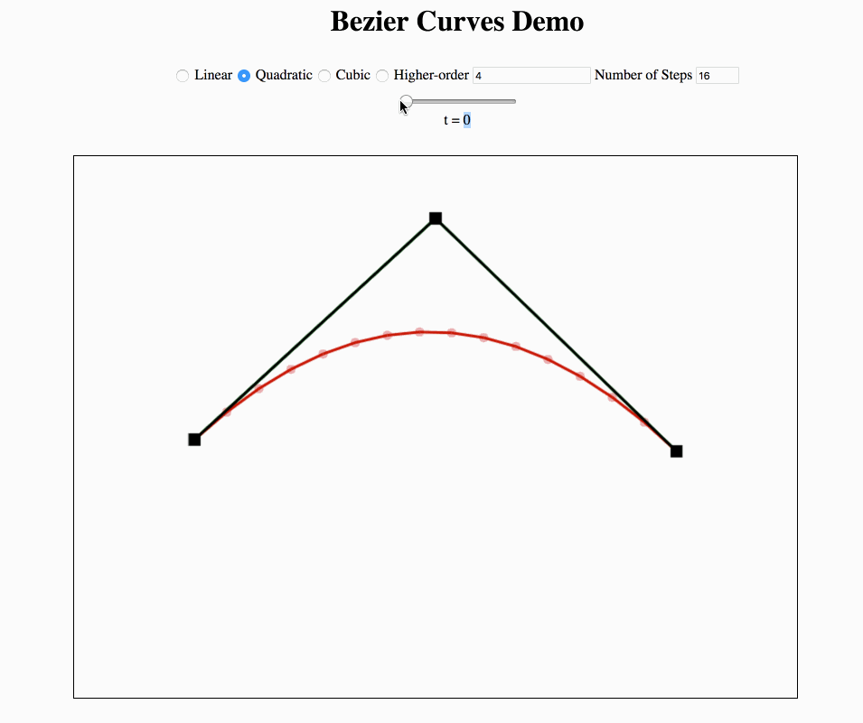

# bezier-curves

An ES5 Javascript demo allowing experimentation with bezier-curves. It supports quadratic, cubic, and any order curves (dependant on computer and browser performance) with draggable control points.

# Demo GIF

## Screenshots

Cubic                                    | Complex
:---------------------------------------:|:-----------------------------------------:
 |